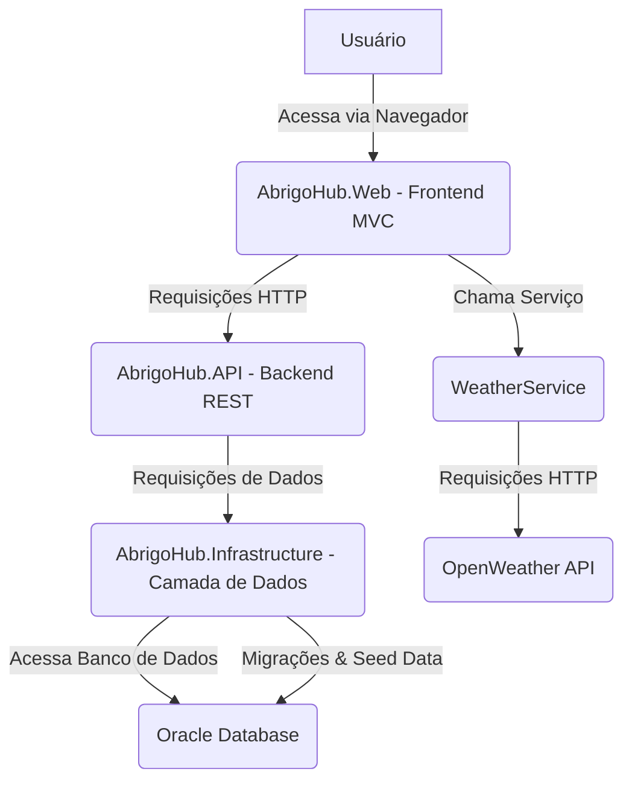

# AbrigoHub: Sistema de Gerenciamento de Abrigos de Emergência

## Sumário
- [Descrição do Projeto](#descrição-do-projeto)
  - [Visão Geral](#visão-geral)
  - [Diagrama da Solução](#diagrama-da-solução)
- [Desenvolvimento](#desenvolvimento)
  - [Tecnologias Utilizadas](#tecnologias-utilizadas)
  - [Estrutura do Projeto](#estrutura-do-projeto)
  - [Configuração do Ambiente](#configuração-do-ambiente)
- [Testes e Acesso à Aplicação](#testes-e-acesso-à-aplicação)
  - [Como Rodar a Aplicação](#como-rodar-a-aplicação)
  - [Instruções de Navegação e Uso](#instruções-de-navegação-e-uso)
  - [Exemplos de Testes](#exemplos-de-testes)

## Descrição do Projeto

### Visão Geral
O AbrigoHub é uma aplicação ASP.NET Core MVC desenvolvida para gerenciar abrigos de emergência, permitindo o cadastro, edição, visualização e exclusão de informações sobre abrigos, usuários, necessidades, doações e avaliações. Ele também integra dados de clima do OpenWeather para fornecer informações relevantes na tela inicial.

### Diagrama da Solução



**Explicação do Diagrama:**
- **Usuário**: Interage com a aplicação através do navegador.
- **AbrigoHub.Web (Frontend MVC)**: É a aplicação web principal, responsável pela interface do usuário e pela lógica de apresentação. Ela faz chamadas para o backend (AbrigoHub.API) para operações CRUD e para o `WeatherService` para dados climáticos.
- **AbrigoHub.API (Backend REST)**: Uma API RESTful que expõe endpoints para gerenciar entidades como Abrigos, Usuários, Necessidades, Doações e Avaliações.
- **WeatherService**: Um serviço dentro do projeto web que interage com a API do OpenWeather para obter dados climáticos.
- **AbrigoHub.Infrastructure (Camada de Dados)**: Contém o `DbContext` (`AbrigoHubContext`), as configurações do Entity Framework Core, as migrações e a lógica de `SeedData` para inicialização do banco de dados.
- **OpenWeather API**: Um serviço externo que fornece dados climáticos.
- **Oracle Database**: O banco de dados relacional utilizado para armazenar todos os dados da aplicação.

## Desenvolvimento

### Tecnologias Utilizadas
- **Backend**: ASP.NET Core 8.0
- **Banco de Dados**: Oracle Database
- **ORM**: Entity Framework Core 8.0 com provedor Oracle (Oracle.EntityFrameworkCore 8.21.121)
- **Interface Web**: ASP.NET Core MVC com Razor Views, Bootstrap, jQuery.
- **Integração Externa**: OpenWeather API
- **Controle de Versão**: Git

### Estrutura do Projeto
A solução `Salvando-Vidas` é organizada nos seguintes projetos:

- `AbrigoHub.sln`: Arquivo de solução que contém todos os projetos.
- `AbrigoHub.Core`: Contém as entidades de domínio (modelos POCO) e interfaces para a lógica de negócio.
    - `Entities/`: Classes que representam as tabelas do banco de dados (e.g., `Abrigo`, `Usuario`, `Doacao`).
- `AbrigoHub.Infrastructure`: Camada de acesso a dados.
    - `Data/`: `DbContext` (`AbrigoHubContext`) e `DbContextFactory` para design-time.
    - `Migrations/`: Arquivos de migração do Entity Framework Core.
    - `SeedData.cs`: Lógica para popular o banco de dados com dados iniciais.
- `AbrigoHub.API`: Projeto da API RESTful.
    - `Controllers/`: Controladores da API para as entidades.
    - `Program.cs`: Configuração da API, injeção de dependência, Swagger.
- `AbrigoHub.Web`: Projeto da aplicação web ASP.NET Core MVC.
    - `Controllers/`: Controladores MVC para as views.
    - `Models/`: Modelos de View e modelos para a API externa (e.g., `WeatherModels.cs`).
    - `Services/`: Serviços de aplicação (e.g., `WeatherService.cs` para integração com OpenWeather).
    - `Views/`: Arquivos `.cshtml` (Razor Views) para a interface do usuário.
    - `wwwroot/`: Arquivos estáticos (CSS, JavaScript, imagens).
    - `appsettings.json`: Configurações da aplicação, incluindo string de conexão do banco de dados e chave da API OpenWeather.
    - `Program.cs`: Configuração da aplicação web, injeção de dependência.
    - `Properties/launchSettings.json`: Configurações de inicialização do projeto (porta, etc.).

### Configuração do Ambiente

1.  **Pré-requisitos:**
    *   .NET SDK 8.0 ou superior.
    *   Cliente Oracle para acesso ao banco de dados Oracle.
    *   Git para clonar o repositório.

2.  **Configuração do Banco de Dados:**
    *   Certifique-se de ter uma instância do Oracle Database acessível.
    *   Atualize a string de conexão no `appsettings.json` do projeto `AbrigoHub.API/AbrigoHub.Web/` para apontar para o seu banco de dados Oracle.
        ```json
        "ConnectionStrings": {
          "DefaultConnection": "DATA SOURCE=seu_servidor:sua_porta/seu_servico;USER ID=seu_usuario;PASSWORD=sua_senha;"
        }
        ```
    *   Aplique as migrações do Entity Framework Core para criar o esquema do banco de dados e popular os dados iniciais:
        ```bash
        dotnet ef database update --project AbrigoHub.Infrastructure/AbrigoHub.Infrastructure.csproj --startup-project AbrigoHub.API/AbrigoHub.Web/AbrigoHub.Web.csproj
        ```

3.  **Configuração da API OpenWeather:**
    *   Obtenha uma chave de API gratuita no [OpenWeatherMap](https://openweathermap.org/api).
    *   Adicione sua chave de API ao `appsettings.json` do projeto `AbrigoHub.API/AbrigoHub.Web/`:
        ```json
        "OpenWeather": {
          "ApiKey": "SUA_CHAVE_API_OPENWEATHER",
          "BaseUrl": "http://api.openweathermap.org/data/2.5/"
        }
        ```

## Testes e Acesso à Aplicação

### Como Rodar a Aplicação

1.  **Navegue até o diretório raiz da solução:**
    ```bash
    cd C:\Fiap\Salvando-Vidas
    ```
2.  **Inicie a aplicação web:**
    ```bash
    dotnet run --project AbrigoHub.API/AbrigoHub.Web/AbrigoHub.Web.csproj
    ```
    A aplicação será iniciada e você verá mensagens no terminal indicando a URL (por exemplo, `http://localhost:5160`).

### Instruções de Navegação e Uso

Após iniciar a aplicação, abra seu navegador e acesse a URL fornecida (geralmente `http://localhost:5160`).

1.  **Página Inicial (Home):**
    *   A tela inicial (`/Home/Index`) exibirá dados do clima para "São Paulo", se a integração com o OpenWeather estiver configurada corretamente.
    *   Você encontrará um link na barra de navegação para "Abrigos".

2.  **Tela de Abrigos:**
    *   Acesse a tela de abrigos clicando no link "Abrigos" na barra de navegação ou navegando diretamente para `/Abrigos`.
    *   Você deve ver uma lista dos abrigos pré-cadastrados (se o `SeedData` foi executado com sucesso).

3.  **CRUD de Abrigos:**
    *   **Visualizar Detalhes (Details):** Clique no link "Detalhes" ao lado de um abrigo na lista para ver informações mais detalhadas.
    *   **Editar Abrigo (Edit):**
        *   Clique no link "Editar" ao lado de um abrigo.
        *   Na tela de edição, altere os campos desejados (Nome, Descrição, Endereço, etc.).
        *   **Certifique-se de que o campo "Usuário" esteja selecionado**, pois é um campo obrigatório. Você precisará de pelo menos um usuário no banco de dados (gerado pelo `SeedData`).
        *   Clique em "Salvar" para persistir as alterações.
        *   Se houver problemas ao salvar, verifique a saída do terminal para mensagens de log (que adicionei para depuração) ou erros do `ModelState`.
    *   **Criar Novo Abrigo (Create):**
        *   Clique no botão "Novo" na tela de Abrigos.
        *   Preencha todos os campos obrigatórios.
        *   **Selecione um "Usuário"** na lista suspensa.
        *   Clique em "Criar" para adicionar o novo abrigo.
    *   **Excluir Abrigo (Delete):**
        *   Clique no link "Excluir" ao lado de um abrigo.
        *   Na tela de confirmação, clique em "Excluir" novamente para remover o abrigo.

### Exemplos de Testes

Para validar o funcionamento da aplicação, você pode seguir estes exemplos:

1.  **Verificar dados pré-cadastrados:**
    *   Após iniciar a aplicação e acessar `/Abrigos`, confirme que os abrigos criados pelo `SeedData` (e.g., "Abrigo Esperança", "Abrigo Aconchego") estão visíveis na lista.

2.  **Editar um abrigo existente:**
    *   Na página `/Abrigos`, clique em "Editar" para "Abrigo Esperança".
    *   Altere o campo "Descrição" para "Um local seguro para famílias em momentos de crise, com capacidade ampliada.".
    *   Clique em "Salvar".
    *   Volte para a lista de abrigos e verifique se a descrição foi atualizada.

3.  **Criar um novo abrigo:**
    *   Na página `/Abrigos`, clique em "Novo".
    *   Preencha os seguintes dados:
        *   **Nome**: "Novo Abrigo Teste"
        *   **Descricao**: "Abrigo criado para teste de funcionalidade."
        *   **Endereco**: "Rua dos Testes, 123"
        *   **Cidade**: "São Paulo"
        *   **Estado**: "SP"
        *   **Cep**: "01000-000"
        *   **Capacidade**: 50
        *   **OcupacaoAtual**: 0
        *   **Status**: "Ativo"
        *   **Usuário**: Selecione "Admin" (ou o usuário que você seeded).
        *   **Latitude**: -23.5505 (ou qualquer valor)
        *   **Longitude**: -46.6333 (ou qualquer valor)
    *   Clique em "Criar".
    *   Verifique se "Novo Abrigo Teste" aparece na lista de abrigos.

4.  **Excluir um abrigo:**
    *   Na página `/Abrigos`, localize o "Novo Abrigo Teste" que você criou.
    *   Clique em "Excluir" ao lado dele.
    *   Confirme a exclusão na próxima tela.
    *   Verifique se o abrigo foi removido da lista.
