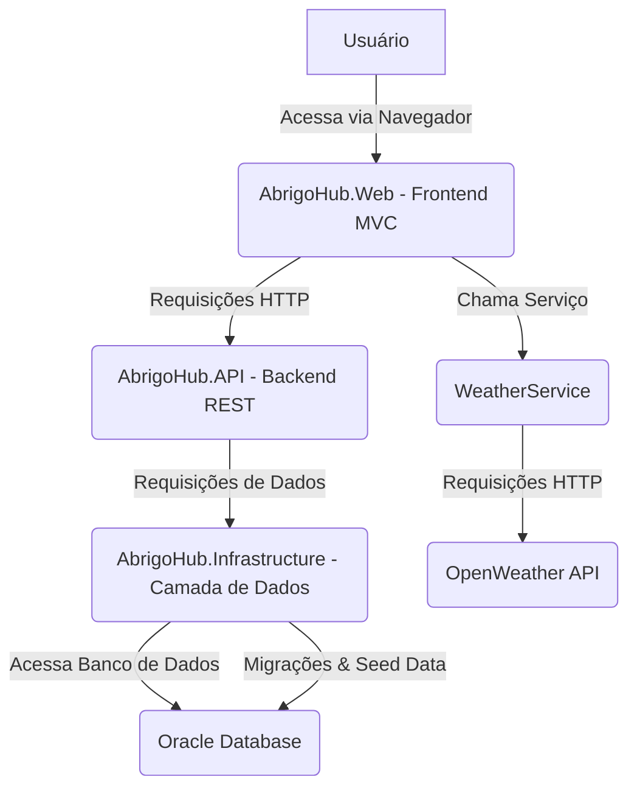
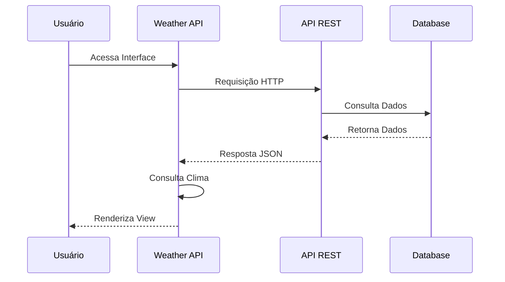
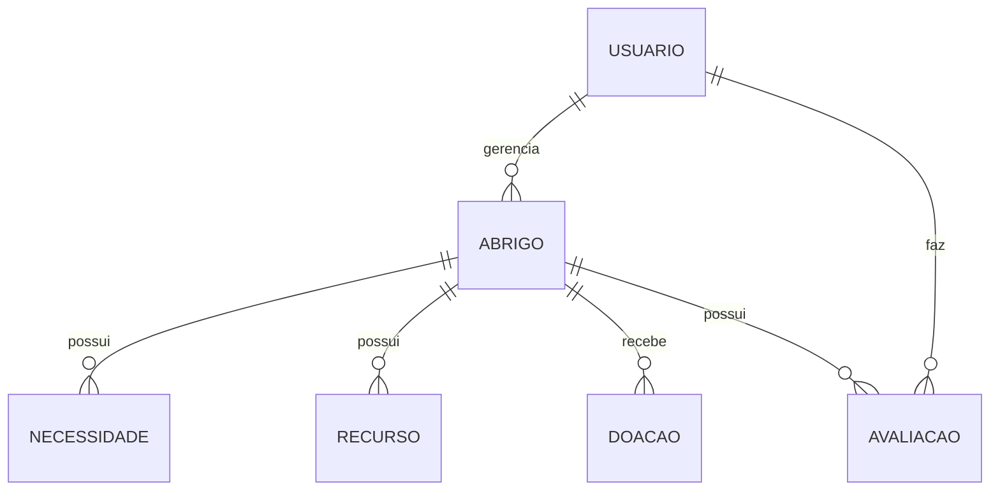

# AbrigoHub: Sistema de Gerenciamento de Abrigos de Emergência

## Repositório
- Link do GitHub: [https://github.com/Coutinh00/Salvando-Vidas](https://github.com/Coutinh00/Salvando-Vidas)
- Branch principal: `main`
- Última atualização: [Data da última atualização]

## Sumário
- [Descrição do Projeto](#descrição-do-projeto)
  - [Visão Geral](#visão-geral)
  - [Diagrama da Solução](#diagrama-da-solução)
- [Arquitetura](#arquitetura)
  - [Padrões Arquiteturais](#padrões-arquiteturais)
  - [Camadas da Aplicação](#camadas-da-aplicação)
- [API REST](#api-rest)
  - [Endpoints Principais](#endpoints-principais)
  - [Autenticação e Autorização](#autenticação-e-autorização)
- [Banco de Dados](#banco-de-dados)
  - [Diagrama ER](#diagrama-er)
  - [Relacionamentos](#relacionamentos)
  - [Migrações](#migrações)
- [Desenvolvimento](#desenvolvimento)
  - [Tecnologias Utilizadas](#tecnologias-utilizadas)
  - [Estrutura do Projeto](#estrutura-do-projeto)
  - [Configuração do Ambiente](#configuração-do-ambiente)
- [Testes](#testes)
  - [Estratégia de Testes](#estratégia-de-testes)
  - [Testes Unitários](#testes-unitários)
  - [Testes de Integração](#testes-de-integração)
- [Testes e Acesso à Aplicação](#testes-e-acesso-à-aplicação)
  - [Como Rodar a Aplicação](#como-rodar-a-aplicação)
  - [Instruções de Navegação e Uso](#instruções-de-navegação-e-uso)
  - [Exemplos de Testes](#exemplos-de-testes)

## Descrição do Projeto

### Visão Geral
O AbrigoHub é uma aplicação ASP.NET Core MVC desenvolvida para gerenciar abrigos de emergência, permitindo o cadastro, edição, visualização e exclusão de informações sobre abrigos, usuários, necessidades, doações e avaliações. Ele também integra dados de clima do OpenWeather para fornecer informações relevantes na tela inicial.

### Diagrama da Solução



### Diagrama de Fluxo de Dados



**Explicação do Diagrama:**
- **Usuário**: Interage com a aplicação através do navegador.
- **AbrigoHub.Web (Frontend MVC)**: É a aplicação web principal, responsável pela interface do usuário e pela lógica de apresentação. Ela faz chamadas para o backend (AbrigoHub.API) para operações CRUD e para o `WeatherService` para dados climáticos.
- **AbrigoHub.API (Backend REST)**: Uma API RESTful que expõe endpoints para gerenciar entidades como Abrigos, Usuários, Necessidades, Doações e Avaliações.
- **WeatherService**: Um serviço dentro do projeto web que interage com a API do OpenWeather para obter dados climáticos.
- **AbrigoHub.Infrastructure (Camada de Dados)**: Contém o `DbContext` (`AbrigoHubContext`), as configurações do Entity Framework Core, as migrações e a lógica de `SeedData` para inicialização do banco de dados.
- **OpenWeather API**: Um serviço externo que fornece dados climáticos.
- **Oracle Database**: O banco de dados relacional utilizado para armazenar todos os dados da aplicação.

## Arquitetura

### Padrões Arquiteturais
O AbrigoHub segue os seguintes padrões arquiteturais:
- **Clean Architecture**: Separação clara entre domínio, aplicação e infraestrutura
- **Repository Pattern**: Para abstração do acesso a dados
- **Dependency Injection**: Para injeção de dependências
- **CQRS**: Para separação de operações de leitura e escrita

### Camadas da Aplicação
1. **Core**: Contém as entidades de domínio e interfaces
2. **Infrastructure**: Implementa a persistência e serviços externos
3. **API**: Expõe os endpoints REST
4. **Web**: Interface do usuário MVC

## API REST

### Endpoints Principais

#### Abrigos
```http
GET /api/abrigos
GET /api/abrigos/{id}
POST /api/abrigos
PUT /api/abrigos/{id}
DELETE /api/abrigos/{id}
```

#### Usuários
```http
GET /api/usuarios
POST /api/usuarios
PUT /api/usuarios/{id}
```

#### Doações
```http
GET /api/doacoes
POST /api/doacoes
GET /api/abrigos/{id}/doacoes
```

### Autenticação e Autorização
- Autenticação via JWT (JSON Web Tokens)
- Roles implementadas: Admin, Gestor, Voluntário
- Endpoints protegidos com atributos [Authorize]

## Banco de Dados

### Diagrama ER


### Relacionamentos
1. **Usuario -> Abrigo (1:N)**
   - Um usuário pode gerenciar vários abrigos
   - Um abrigo pertence a um único usuário

2. **Abrigo -> Necessidade (1:N)**
   - Um abrigo pode ter várias necessidades
   - Uma necessidade pertence a um único abrigo

3. **Abrigo -> Recurso (1:N)**
   - Um abrigo pode ter vários recursos
   - Um recurso pertence a um único abrigo

### Migrações
O projeto utiliza Entity Framework Core Migrations para gerenciar o esquema do banco de dados:

```bash
# Criar nova migração
dotnet ef migrations add NomeDaMigracao

# Aplicar migrações
dotnet ef database update
```

## Testes

### Estratégia de Testes
O projeto implementa uma estratégia de testes em três níveis:

1. **Testes Unitários**
   - Testes de serviços
   - Testes de repositórios
   - Testes de validações

2. **Testes de Integração**
   - Testes de API
   - Testes de banco de dados
   - Testes de serviços externos

3. **Testes de UI**
   - Testes de interface
   - Testes de navegação
   - Testes de formulários

### Testes Unitários
Exemplo de teste unitário para o serviço de abrigos:

```csharp
[Fact]
public async Task CriarAbrigo_ComDadosValidos_DeveRetornarSucesso()
{
    // Arrange
    var abrigo = new Abrigo 
    { 
        Nome = "Teste",
        Endereco = "Rua Teste",
        UsuarioId = 1
    };

    // Act
    var resultado = await _abrigoService.CriarAbrigo(abrigo);

    // Assert
    Assert.True(resultado.Sucesso);
    Assert.NotNull(resultado.Dados);
}
```

### Testes de Integração
Exemplo de teste de integração para a API de abrigos:

```csharp
[Fact]
public async Task GetAbrigos_DeveRetornarListaDeAbrigos()
{
    // Arrange
    var client = _factory.CreateClient();

    // Act
    var response = await client.GetAsync("/api/abrigos");

    // Assert
    response.EnsureSuccessStatusCode();
    var abrigos = await response.Content.ReadFromJsonAsync<List<Abrigo>>();
    Assert.NotNull(abrigos);
    Assert.NotEmpty(abrigos);
}
```

### Testes de UI
Exemplo de teste de interface:

```csharp
[Fact]
public async Task CriarAbrigo_DeveRedirecionarParaLista()
{
    // Arrange
    var client = _factory.CreateClient();
    var formData = new Dictionary<string, string>
    {
        { "Nome", "Novo Abrigo" },
        { "Endereco", "Rua Teste" },
        { "UsuarioId", "1" }
    };

    // Act
    var response = await client.PostAsync("/Abrigos/Create", new FormUrlEncodedContent(formData));

    // Assert
    Assert.Equal(HttpStatusCode.Redirect, response.StatusCode);
    Assert.StartsWith("/Abrigos", response.Headers.Location.ToString());
}
```

## Testes e Acesso à Aplicação

### Como Rodar a Aplicação

1. **Clone o Repositório**
   ```bash
   git clone https://github.com/Coutinh00/Salvando-Vidas.git
   cd Salvando-Vidas
   ```

2. **Restauração de Pacotes**
   ```bash
   dotnet restore
   ```

3. **Configuração do Banco de Dados**
   - Atualize a string de conexão em `appsettings.json`
   - Execute as migrações:
     ```bash
     dotnet ef database update
     ```

4. **Execução da Aplicação**
   ```bash
   dotnet run --project AbrigoHub.Web
   ```

### Instruções de Navegação e Uso

1. **Acesso à Aplicação**
   - URL: `http://localhost:5160`
   - Credenciais padrão:
     - Usuário: admin@abrigohub.com
     - Senha: Admin@123

2. **Funcionalidades Principais**
   - Cadastro de Abrigos
   - Gerenciamento de Usuários
   - Registro de Doações
   - Avaliação de Abrigos

### Exemplos de Testes

1. **Teste de Cadastro de Abrigo**
   ```http
   POST /api/abrigos
   Content-Type: application/json

   {
     "nome": "Abrigo Teste",
     "endereco": "Rua Teste, 123",
     "cidade": "São Paulo",
     "estado": "SP",
     "cep": "01000-000",
     "capacidade": 50,
     "usuarioId": 1
   }
   ```

2. **Teste de Consulta de Abrigos**
   ```http
   GET /api/abrigos
   Authorization: Bearer {seu_token}
   ```

3. **Teste de Atualização de Abrigo**
   ```http
   PUT /api/abrigos/1
   Content-Type: application/json

   {
     "nome": "Abrigo Teste Atualizado",
     "capacidade": 100
   }
   ```

4. **Teste de Exclusão de Abrigo**
   ```http
   DELETE /api/abrigos/1
   Authorization: Bearer {seu_token}
   ```

### Executando os Testes

1. **Testes Unitários**
   ```bash
   dotnet test AbrigoHub.Tests
   ```

2. **Testes de Integração**
   ```bash
   dotnet test AbrigoHub.IntegrationTests
   ```

3. **Testes de UI**
   ```bash
   dotnet test AbrigoHub.UITests
   ```
